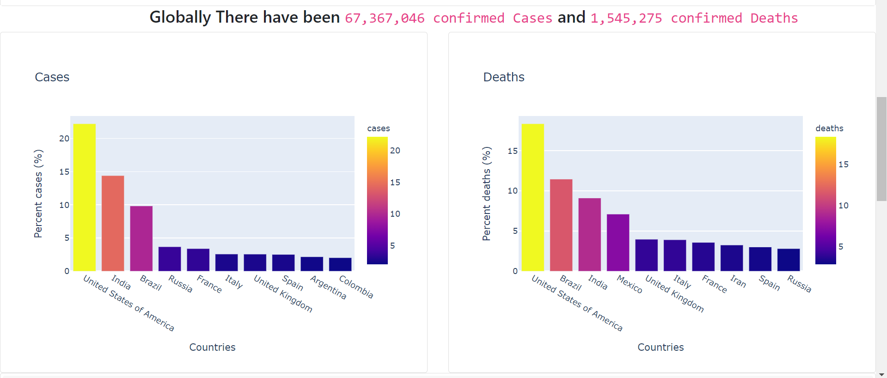
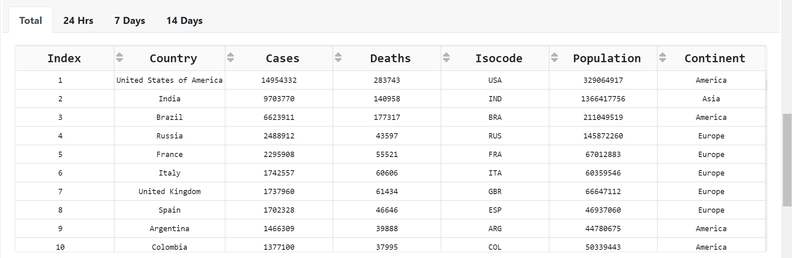
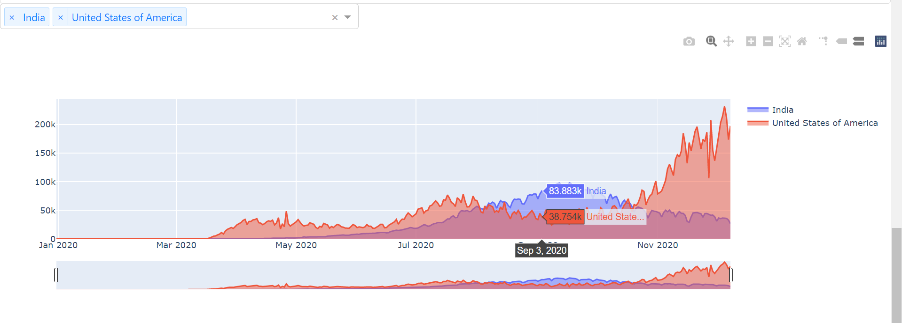

# Covid-19-Spread-Analysis-Dashboard
Dashboard, Tracks Real-Time data on Covid-19 

World Map showing Total reported Cases, color scale signifying the Number of Cases.
  
 
World Map showing Total reported Cases, color scale signifying the Number of Cases.
  

Two Bar Plots showcasing the 10 countries with Highest number of Cases and Deaths respectively.
  
  
Data Table displaying the records or each country, Cases Reported, Deaths Reported, their ISO code, Population and
 their Continent. 
 24Hrs Tab displays the data reported within the last 24 hours 
 7 Days  Tab displays the data reported within the last 7 Days 
 14 Days Tab displays the data reported within the last 14 Days.
   
   
 An Area chart that show the time series data for country(countries) selected from the dropdown menu
